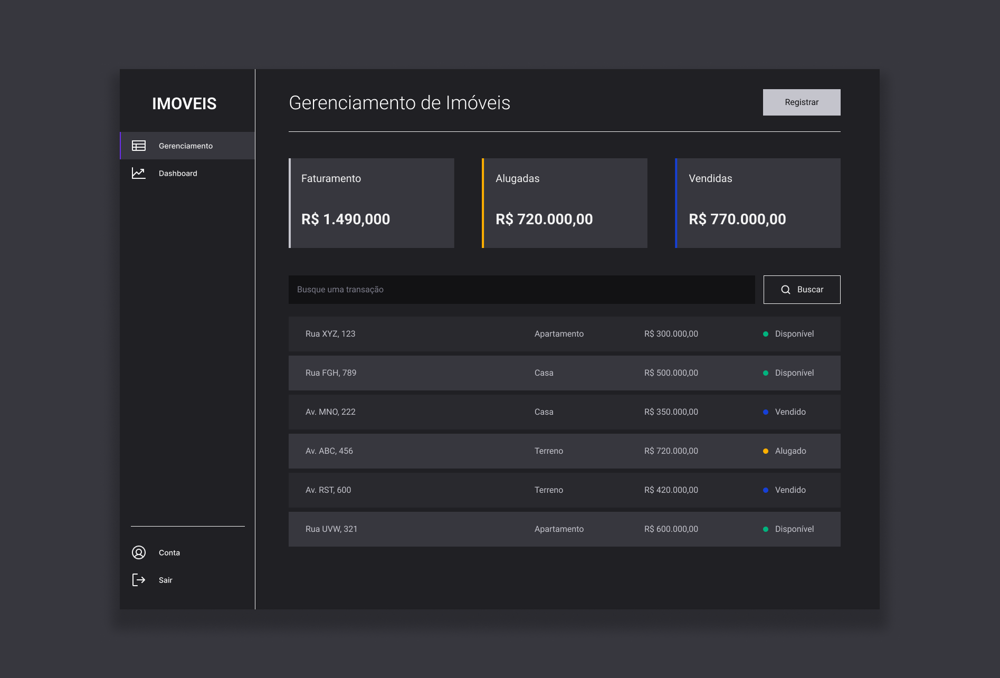

# Gerenciamento de Imóveis

#
Este projeto é um aplicativo de CRUD (Create, Read, Update, Delete) desenvolvido para o gerenciamento de imóveis. 
Com ele, os usuários podem cadastrar, visualizar e editar informações detalhadas sobre diferentes propriedades. 
Cada imóvel é caracterizado por dados essenciais, incluindo endereço, preço, tipo e status.

## Funcionalidades Principais
- **Cadastro de Imóveis:** Permite aos usuários registrar novos imóveis, fornecendo informações detalhadas como endereço, preço, tipo e status.
- **Visualização de Imóveis:** Oferece uma visão clara e organizada de todos os imóveis cadastrados. Os usuários podem examinar as propriedades e seus detalhes.
- **Edição de Informações:** Permite a edição de dados de imóveis já cadastrados. Isso possibilita a atualização de informações conforme necessário.
- **Status de Locação:** Os imóveis possuem status específicos, indicando se estão disponíveis para locação, já alugados ou atualmente ocupados.

## Funcionalidades Adicionais
- **Sumário de Faturamento na Página Principal:**
A página principal apresenta um sumário do faturamento, exibindo informações sobre o faturamento de imóveis alugados, vendidos e o faturamento total. Essa funcionalidade fornece uma visão rápida e eficiente do desempenho financeiro do portfólio de imóveis.

- Dashboard:
Além disso, o projeto inclui uma página de dashboard simples, onde os usuários podem visualizar estatísticas como média de preço por categoria e a porcentagem de imóveis por tipo, proporcionando uma visão analítica do conjunto de propriedades.

## Tecnologias Utilizadas
- [Styled-Components](https://styled-components.com) - Para Estilização.
- [React](https://reactjs.org/) - Biblioteca JS.
- [TypeScript](https://www.typescriptlang.org) - Superset de JavaScript que traz tipagem estática para o projeto.
- [Vite](https://vitejs.dev) - Ferramenta de Desenvolvimento
- [Axios](https://axios-http.com/ptbr/) - Cliente HTTP
- [Radix UI](https://www.radix-ui.com/primitives) - Componentes primitivos para criar interfaces de usuário acessíveis.
- [JSON Server](https://github.com/typicode/json-server) - Uma biblioteca para criar rapidamente uma API REST fake para testar e prototipar.
- [React Chart.js 2](https://reactchartjs.github.io/react-chartjs-2/) - Biblioteca para criação de gráficos e visualizações de dados com React.
- [React Hook Form](https://react-hook-form.com) - Biblioteca eficiente para formulários em React.
- [Zod](https://zod.dev) - Uma biblioteca de validação de esquema TypeScript.

